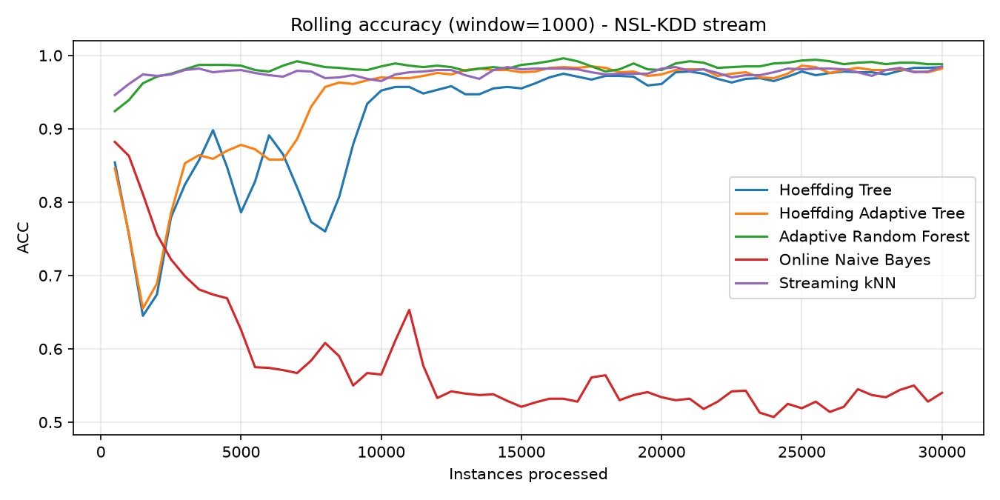
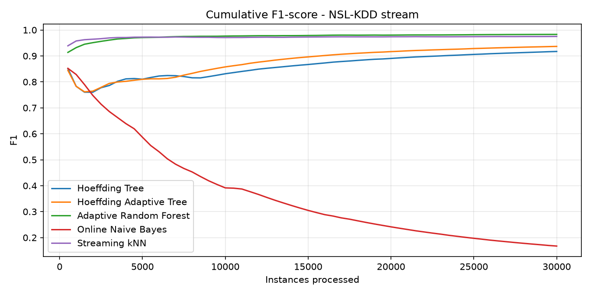
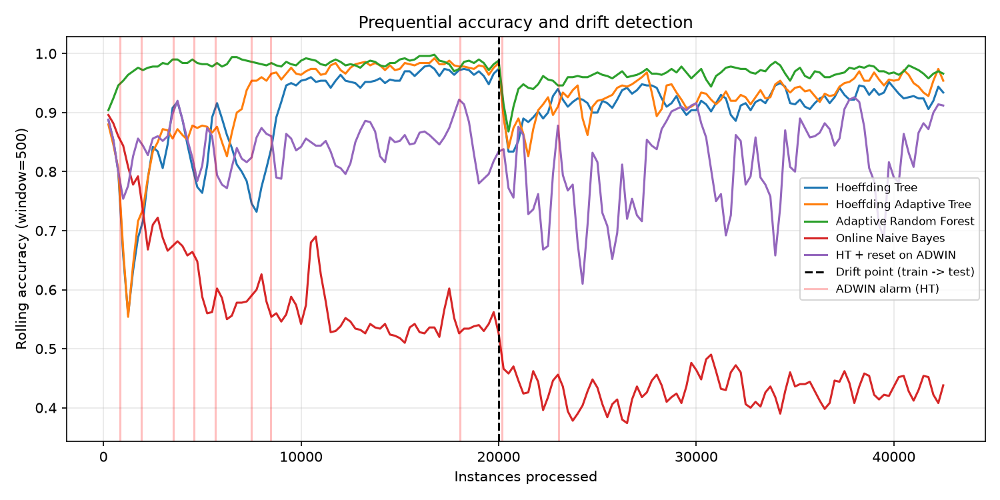

# Machine Learning for Intrusion Detection and Prevention

### Leveraging Adaptive AI Techniques for Real-Time Cyber-Threat Detection and Automated Response

An experimental framework for **real-time network intrusion detection using streaming machine learning**. The project evaluates multiple incremental learning algorithms on continuously arriving network traffic, investigates their behaviour under concept drift, and compares them using accuracy, F1-score, latency, and model footprint.

The framework is designed around the idea that a deployed intrusion detection system should not remain static: as network behaviour and attack patterns evolve, the detection model should be able to learn from new data and adapt without requiring complete offline retraining.

---

## Overview

Traditional machine-learning-based Intrusion Detection Systems (IDS) are commonly trained offline using historical network datasets. Although these models can achieve high performance on benchmark datasets, their performance may deteriorate when network traffic changes over time.

This project explores **streaming / online machine learning** for intrusion detection, where:

- Network traffic is processed one instance at a time.
- Each instance is first classified and then used for model training.
- Multiple online learning algorithms operate on the same stream.
- Concept drift detection mechanisms identify changes in the underlying data distribution.
- Model performance is evaluated continuously rather than using only a conventional train/test split.
- Computational characteristics such as prediction latency and model size are also measured.

The current implementation uses **NSL-KDD** as the primary dataset and the **River** streaming machine-learning framework.

---

## Key Features

- Real-time network traffic stream simulation
- Prequential (test-then-train) evaluation
- Multiple incremental ML algorithms
- Concept drift detection
- Adaptive learning for evolving traffic
- Rolling accuracy and cumulative F1 monitoring
- Per-instance latency measurement
- Model-size / memory-footprint estimation
- Comparative evaluation of streaming models
- Drift-recovery analysis
- Extensible architecture for automated prevention mechanisms

---

## Models Evaluated

The framework currently evaluates five streaming classifiers:

| Model | Description |
| --- | --- |
| **Hoeffding Tree** | Incremental decision tree designed for high-volume data streams |
| **Hoeffding Adaptive Tree (HAT)** | Adaptive Hoeffding Tree incorporating drift-aware learning |
| **Adaptive Random Forest (ARF)** | Ensemble of adaptive online decision trees designed for evolving streams |
| **Online Naive Bayes** | Lightweight probabilistic incremental classifier |
| **Streaming k-NN** | Incremental nearest-neighbour classifier for streaming data |

All models process the **same traffic stream** under the same prequential evaluation procedure.

---

## Concept Drift

Network traffic is not stationary. New applications, user behaviour, network configurations, and attack strategies can change the statistical characteristics of incoming traffic.

This phenomenon is known as **concept drift**.

The project investigates several drift detection techniques:

- **ADWIN** — Adaptive Windowing
- **DDM** — Drift Detection Method
- **EDDM** — Early Drift Detection Method

A drift experiment is performed by transitioning from the KDDTrain+ stream to KDDTest+, allowing the framework to examine how quickly different models detect and recover from a change in traffic distribution.

---

## Evaluation Methodology

The project uses **prequential evaluation**, also known as test-then-train evaluation.

For every incoming sample:

```
Incoming Network Traffic
          │
          ▼
     Predict Label
          │
          ▼
    Record Metrics
          │
          ▼
     Detect Drift
          │
          ▼
      Train Model
          │
          ▼
   Process Next Sample
```

This evaluation strategy better represents a continuously operating IDS because the model is evaluated on an instance before learning from that instance.

---

## Metrics

The framework records several performance and deployment-oriented metrics.

### Classification Metrics

- Accuracy
- Precision
- Recall
- F1-score

### Streaming Metrics

- Rolling accuracy
- Cumulative F1-score
- Drift detection time
- Drift-recovery time
- Number of drift alarms

### Computational Metrics

- Per-instance latency
- Serialized model size
- Approximate memory footprint

Evaluating both predictive performance and computational cost is important because an IDS must operate under real-time constraints.

---

## Baseline Results

A preliminary experiment was performed using the first **30,000 instances** of the shuffled KDDTrain+ dataset.

The traffic was converted into a binary classification problem:

- `Normal`
- `Attack`

Each sample was first evaluated and then used for incremental training.

| Model | Accuracy | Precision | Recall | F1 | Latency (ms/instance) | Model Size |
| --- | --- | --- | --- | --- | --- | --- |
| Hoeffding Tree | 92.01% | 0.888 | 0.949 | 0.917 | 0.65 | 8.6 MB |
| Hoeffding Adaptive Tree | 94.12% | 0.941 | 0.932 | 0.937 | 0.84 | 8.6 MB |
| **Adaptive Random Forest** | **98.42%** | **0.991** | **0.975** | **0.983** | 2.19 | 34.1 MB |
| Online Naive Bayes | 57.58% | 0.998 | 0.091 | 0.167 | 0.99 | 0.9 MB |
| Streaming k-NN | 97.67% | 0.975 | 0.976 | 0.975 | 6.79 | 1.3 MB |

### Initial Observations

- **Adaptive Random Forest** achieved the strongest overall classification performance, reaching 98.42% accuracy and an F1-score of 0.983.
- **Streaming k-NN** achieved competitive classification performance but had the highest per-instance latency.
- **Hoeffding Adaptive Tree** improved upon the standard Hoeffding Tree while maintaining relatively low latency.
- **Online Naive Bayes** achieved high precision but extremely low recall, indicating that it missed a large proportion of attacks.
- The results demonstrate the importance of evaluating streaming classifiers using more than accuracy alone.

> These values represent an initial experimental run and may vary depending on preprocessing, dataset ordering, library versions, and experimental configuration.

---

## Results & Visualizations

The experiments generate visualizations showing how the streaming models behave as new network traffic is processed.

### Rolling Accuracy

The following plot shows rolling accuracy using a window of 1,000 instances. Adaptive Random Forest maintains the strongest and most stable performance, while Online Naive Bayes shows significantly weaker performance.



---

### Cumulative F1-Score

The cumulative F1-score provides a longer-term view of detection performance throughout the stream.



---

### Concept Drift Detection

This plot shows the behaviour of the streaming models during the distribution shift, along with ADWIN drift alarms for the Hoeffding Tree.



---

## Concept Drift Experiment

A second experiment evaluates model behaviour under a simulated distribution shift.

The stream consists of:

```
20,000 KDDTrain+ instances
             │
             ▼
       Drift Boundary
             │
             ▼
22,544 KDDTest+ instances
```

The transition between the datasets is treated as a natural distribution shift for experimental purposes.

### Preliminary Results

| Model | Accuracy Before Drift | Lowest Accuracy After Drift | Recovery | First ADWIN Alarm |
| --- | --- | --- | --- | --- |
| Hoeffding Tree | 96.25% | 83.40% | 7,250 instances | 160 |
| Hoeffding Adaptive Tree | 97.55% | 82.60% | 7,250 instances | 96 |
| **Adaptive Random Forest** | **98.15%** | **86.80%** | **2,250 instances** | **64** |
| Online Naive Bayes | 54.00% | 37.40% | Not recovered | 864 |
| HT + ADWIN Reset | 80.90% | 61.00% | 250\* | 448 |

\*The reset-based model had already degraded before the drift boundary, so its recovery value is not directly comparable with the other models.

### Observations

The preliminary experiment indicates that:

- Tree-based models experience a significant performance drop following the distribution shift.
- Adaptive Random Forest recovers faster than the other evaluated tree-based models.
- ADWIN detects the major distribution change relatively quickly.
- Drift detectors may generate alarms during the initial learning phase because model error is changing even without a deliberate drift event.
- Completely resetting a model after drift can discard useful knowledge and may perform worse than gradual adaptation.

These observations motivate further investigation into **background learners, adaptive windows, and less destructive drift-response strategies**.

---

## Project Architecture

```
                   ┌─────────────────────┐
                   │   Network Dataset   │
                   │  NSL-KDD / Others   │
                   └──────────┬──────────┘
                              │
                              ▼
                   ┌─────────────────────┐
                   │ Data Preprocessing  │
                   │ Encoding / Labels   │
                   └──────────┬──────────┘
                              │
                              ▼
                   ┌─────────────────────┐
                   │  Stream Simulator   │
                   │ Instance-by-instance│
                   └──────────┬──────────┘
                              │
                              ▼
        ┌─────────────────────────────────────────┐
        │         Parallel Streaming Models       │
        │                                         │
        │  HT │ HAT │ ARF │ NB │ Streaming k-NN │
        └──────────────────┬──────────────────────┘
                           │
                           ▼
                 ┌─────────────────────┐
                 │ Prequential Testing │
                 └──────────┬──────────┘
                            │
                            ▼
                 ┌─────────────────────┐
                 │ Concept Drift       │
                 │ ADWIN / DDM / EDDM  │
                 └──────────┬──────────┘
                            │
                            ▼
                 ┌─────────────────────┐
                 │ Metrics & Logging   │
                 │ Accuracy / F1 /     │
                 │ Latency / Recovery  │
                 └──────────┬──────────┘
                            │
                            ▼
                 ┌─────────────────────┐
                 │ Model Comparison    │
                 └──────────┬──────────┘
                            │
                            ▼
                 ┌─────────────────────┐
                 │ Prevention / Alert  │
                 │      Mechanism      │
                 └─────────────────────┘
```

---

## Repository Structure

```
.
├── 01_baseline_models.py
├── 02_drift_detection.py
├── requirements.txt
├── README.md
│
├── results/
│   ├── baseline/
│   └── drift/
│
└── data/
    └── NSL-KDD/
```

The exact contents of `results/` and `data/` may vary depending on the execution configuration.

---

## Installation

### 1\. Clone the repository

```
git clone <your-repository-url>
cd <repository-directory>
```

### 2\. Install dependencies

```
pip install -r requirements.txt
```

Python **3.9 or newer** is recommended.

---

## Running the Experiments

### Baseline Streaming Models

Run the baseline experiment using 30,000 instances:

```
python 01_baseline_models.py 30000
```

For the complete available training stream:

```
python 01_baseline_models.py 125973
```

The baseline experiment evaluates:

- Hoeffding Tree
- Hoeffding Adaptive Tree
- Adaptive Random Forest
- Online Naive Bayes
- Streaming k-NN

---

### Concept Drift Detection

Run the drift experiment:

```
python 02_drift_detection.py 20000
```

The experiment evaluates drift detection using:

- ADWIN
- DDM
- EDDM

It also evaluates model behaviour before and after the distribution shift.

---

## Dataset

The current experiments use the **NSL-KDD** intrusion detection benchmark.

The dataset contains network connection records representing normal traffic and multiple categories of attacks.

The implementation converts the original labels into a binary classification task:

```
Normal → 0
Attack → 1
```

Categorical features are encoded before being supplied to the streaming models.

The dataset is downloaded automatically by the experiment scripts on the first execution, provided an internet connection is available.

### Future Dataset Support

The framework can be extended to additional intrusion-detection datasets, including:

- CICIDS2017
- UNSW-NB15
- Edge-IIoTset
- Other continuously generated network-flow datasets

---

## Technologies Used

| Technology | Purpose |
| --- | --- |
| **Python** | Core implementation |
| **River** | Streaming machine learning |
| **NumPy** | Numerical operations |
| **Pandas** | Data preprocessing |
| **Scikit-learn** | Supporting ML utilities |
| **Matplotlib** | Visualization |
| **Seaborn** | Statistical visualization |
| **Jupyter Notebook** | Experimentation and analysis |
| **Git / GitHub** | Version control |

---

## Why Streaming Machine Learning?

A conventional batch IDS generally follows:

```
Historical Dataset
       ↓
Offline Training
       ↓
Deploy Model
       ↓
Static Predictions
       ↓
Periodic Retraining
```

A streaming IDS instead follows:

```
Live Traffic
     ↓
Prediction
     ↓
Evaluation
     ↓
Incremental Learning
     ↓
Drift Detection
     ↓
Model Adaptation
     ↓
Continuous Operation
```

The second approach is particularly useful when traffic characteristics change frequently and storing or repeatedly retraining on the complete historical dataset is undesirable.

---

## Prevention Mechanism

The detection pipeline is being extended toward an automated prevention layer.

A simplified response architecture is:

```
Network Traffic
      │
      ▼
Streaming Classifier
      │
      ├── Normal ──────► Allow
      │
      └── Attack ──────► Alert / Flag
                              │
                              ▼
                       Response Policy
```

The prevention component is intentionally lightweight and can be extended to support actions such as:

- Generating security alerts
- Flagging suspicious flows
- Logging malicious connections
- Temporarily blocking a source
- Sending events to a SIEM
- Triggering external security automation

The current implementation is intended for **experimental and defensive cybersecurity research**, rather than direct deployment on production infrastructure.

---

## Current Status

### Completed

- [x]Literature and technical background study
- [x]Dataset preprocessing pipeline
- [x]Streaming data simulation
- [x]Hoeffding Tree implementation
- [x]Hoeffding Adaptive Tree implementation
- [x]Adaptive Random Forest implementation
- [x]Online Naive Bayes implementation
- [x]Streaming k-NN implementation
- [x]Prequential evaluation
- [x]Baseline metric collection
- [x]Rolling performance analysis
- [x]Initial concept-drift experiment

### In Progress

- [ ]ADWIN/DDM/EDDM parameter tuning
- [ ]Reducing false drift alarms
- [ ]Improved drift adaptation strategies
- [ ]Complete-stream experiments
- [ ]Repeated runs for statistical consistency
- [ ]Prevention mechanism integration
- [ ]Final comparative analysis

### Planned

- [ ]Support for additional datasets
- [ ]More realistic network-stream simulation
- [ ]Automated model selection
- [ ]Improved memory profiling
- [ ]Real-time dashboard
- [ ]SIEM integration
- [ ]Extended automated response mechanisms

---

## Research Questions

The project investigates the following questions:

1. Which streaming ML algorithm provides the best balance between detection performance and computational cost?
2. How quickly can online models recover from concept drift?
3. Which drift detector provides reliable detection while minimizing false alarms?
4. Does adaptive learning outperform static incremental learning under changing network conditions?
5. What is the trade-off between accuracy, latency, and memory consumption?
6. Can a lightweight streaming classifier support automated intrusion-response decisions?

---

## Limitations

The current implementation has several limitations:

- NSL-KDD is a benchmark dataset rather than a live production network.
- The simulated stream does not reproduce every characteristic of real network traffic.
- The current drift experiment uses a predefined dataset transition as the drift boundary.
- Results are sensitive to stream ordering and model hyperparameters.
- The reported baseline results are from initial experimental runs.
- Serialized model size is used as a proxy for memory footprint and should not be interpreted as exact runtime memory consumption.
- The prevention mechanism is experimental and should not be connected directly to production infrastructure without additional validation and safety controls.

---

## Future Work

Future development will focus on making the framework more representative of real-world deployment.

### Adaptive Learning

Investigate:

- Background learners
- Adaptive ensembles
- Dynamic model weighting
- Adaptive window sizes
- Selective forgetting
- Continual learning

### Improved Drift Detection

Compare and tune:

- ADWIN
- DDM
- EDDM
- Page-Hinkley
- Statistical drift detectors
- Conformal drift detection

### Dataset Expansion

Evaluate the framework across:

- NSL-KDD
- CICIDS2017
- UNSW-NB15
- Edge-IIoTset
- Live or replayed network-flow data

### Real-Time Deployment

Potential extensions include:

```
Network Capture
      ↓
Kafka / Streaming Queue
      ↓
Feature Extraction
      ↓
Online IDS
      ↓
Drift Detection
      ↓
Threat Classification
      ↓
Alert / Response
```

This would allow the experimental framework to move from offline dataset replay toward a more realistic streaming cybersecurity environment.

---

## Reproducibility

For reproducible experiments, record:

- Python version
- River version
- Dataset version
- Dataset ordering
- Number of instances
- Model parameters
- Drift detector parameters
- Random seeds where applicable
- Hardware configuration

Example:

```
Python: 3.11
Dataset: NSL-KDD
Evaluation: Prequential
Stream size: 30,000
Task: Binary classification
Framework: River
```

---

## Performance Considerations

There is no single universally optimal model for an online IDS.

For example:

- **ARF** provides strong predictive performance but has a larger computational footprint.
- **HAT** provides a useful balance between adaptation and resource requirements.
- **Hoeffding Tree** offers low latency and relatively low complexity.
- **Streaming k-NN** can achieve high classification performance but may become expensive as the stream grows.
- **Online Naive Bayes** has a small footprint but may be unsuitable when its underlying assumptions do not match the traffic distribution.

Therefore, model selection should consider **accuracy, recall, latency, memory, drift recovery, and operational requirements together**.

---

## Security Considerations

This repository focuses on defensive cybersecurity applications such as:

- Intrusion detection
- Threat classification
- Anomaly detection
- Concept-drift analysis
- Security alerting
- Automated defensive response

Any automated prevention mechanism should be tested in an isolated environment before being connected to production networks.

---

## License

Add an appropriate license before distributing the repository publicly.

For example:

```
MIT License
```

if the project is intended to be released under the MIT License.

---

## Author

**Chirag Sharma**

B.Tech – Artificial Intelligence & Data Science

---

## Acknowledgements

This project builds upon research and open-source work in:

- Streaming machine learning
- Concept drift detection
- Adaptive ensemble learning
- Network intrusion detection
- Online cybersecurity analytics

Special consideration is given to the contributions of the open-source **River** ecosystem for enabling incremental and streaming machine-learning experimentation.

---

## Citation

If you use this repository or its methodology in your research or other work, please cite the repository using the citation information provided in the GitHub repository.

---